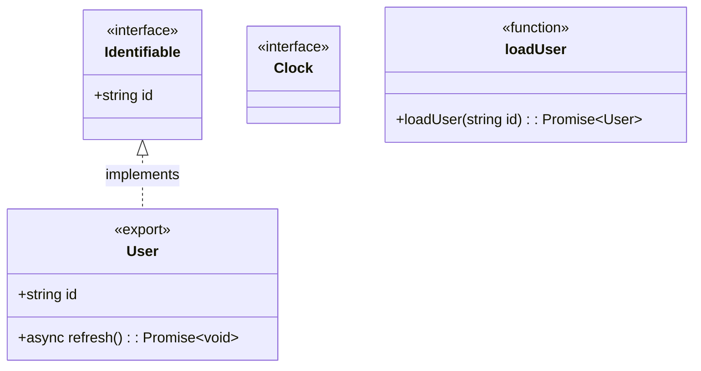

# Mermaid code diagram checker experiment

This isolated prototype validates TypeScript structure and execution flow against separate Mermaid diagram files. It is not connected to Pi's source checks or `npm run check`.

## Deterministic generation

Generate a class diagram from a class or interface declared in an entry file:

```bash
node experiments/mermaid-class-check/generate.mjs class \
  packages/agent/src/types.ts AgentTool \
  --source packages/agent/src \
  --output /tmp/agent-tool.class.mmd
```

Generate a call-flow diagram from a top-level function or class method:

```bash
node experiments/mermaid-class-check/generate.mjs flow \
  packages/agent/src/agent.ts Agent.prompt \
  --source packages/agent/src \
  --output /tmp/agent-prompt.flow.mmd
```

The generator recursively discovers source files, builds diagrams from the TypeScript AST, validates the generated text with the matching checker, and only then writes it. Without `--output`, it writes Mermaid to stdout. `--depth N` and `--max-nodes N` bound traversal; defaults are depth 1 and 20 nodes for classes, and depth 6 and 24 nodes for flows. Repeat `--source` to combine roots. Class and flow outputs are always separate `.mmd` files.

## Manual checking

Run the sample:

```bash
node experiments/mermaid-class-check/check.mjs \
  experiments/mermaid-class-check/fixtures/sample.mmd \
  experiments/mermaid-class-check/fixtures/sample.ts
```

Source inputs may be individual TypeScript files or directories. Directories are scanned recursively:

```bash
node experiments/mermaid-class-check/check.mjs \
  experiments/mermaid-class-check/fixtures/pi-agent-tool-calls.mmd \
  packages/agent/src
```

The scanner includes `.ts`, `.tsx`, `.mts`, and `.cts` source files. It ignores declaration files, symlinks, and `.git`, `.worktrees`, `dist`, and `node_modules` directories. Overlapping inputs are deduplicated. If a diagram node is not found anywhere under the supplied roots, the checker reports the missing class, interface, function, import, or export.

Class structure and execution flow remain separate:

- `fixtures/pi-agent-tool-calls.mmd` is checked by `check.mjs`.
- `fixtures/pi-agent-tool-flow.mmd` is checked by `flow-check.mjs`.

Run the high-level flow check:

```bash
node experiments/mermaid-class-check/flow-check.mjs \
  experiments/mermaid-class-check/fixtures/pi-agent-tool-flow.mmd \
  packages/agent/src
```

Flow nodes map to top-level functions by node ID. Use `%% pi:symbol readableNode ClassName.methodName` or `%% pi:symbol readableNode functionName` when a readable node ID differs from the code symbol. Each edge must be backed by either a direct/transitive static call path or two phases called in that order by a shared orchestrator. Missing symbols and unsupported flow edges are errors. `%% pi:concept nodeId` marks a purely explanatory node; edges touching it are intentionally not code-validated.

Run the focused tests:

```bash
node --test \
  experiments/mermaid-class-check/check.test.mjs \
  experiments/mermaid-class-check/flow-check.test.mjs \
  experiments/mermaid-class-check/generate.test.mjs
```

## Supported class diagram shape



Diagram nodes default to `class`. Stereotypes add TypeScript-specific constraints:

- Nodes without a kind stereotype require a class declaration. Mermaid reserves `class`, so do not write `<<class>>`.
- `<<interface>> Name` requires an interface declaration.
- `<<function>> name` treats the same-named method inside the node as a top-level function signature.
- `<<async>> name` requires an async top-level function. Methods use `+async method(): Promise~T~`.
- `<<export>> Name` requires a named export.
- `<<export>> Name` plus `%% pi:default-export Name` requires a default export.
- `<<import>> Name` requires an imported local binding.
- `<<import>> Name` plus `%% pi:import Name from "./module.ts"` also requires the exact module specifier.

Checker metadata that cannot be represented by Mermaid stereotypes uses `%% pi:...` comments. Mermaid renderers ignore these comments, while the checker reads them. This keeps every accepted example renderable by standard Mermaid tools.

Relationships map to TypeScript as follows:

- `Base <|-- Child` or `Child --|> Base` requires `Child extends Base`.
- `Contract <|.. Implementation` or `Implementation ..|> Contract` requires `Implementation implements Contract`.
- Associations, aggregations, and compositions require a typed member reference. A target `"*"` multiplicity requires an array, `ReadonlyArray`, or `Set`.

The checker also verifies:

- public (`+`), private (`-`), and protected (`#`) visibility;
- property names and explicitly declared TypeScript types;
- method names, parameter types, return types, and async modifiers;
- static members marked with Mermaid's trailing `$`;
- imports and named/default exports across all supplied source files.

Extra TypeScript members are allowed. Type comparison is intentionally syntactic. It supports aliases such as `String` to `string`, `Integer` to `number`, `List<T>` to `T[]`, and Mermaid generic notation such as `Promise~User~` to `Promise<User>`.

The prototype does not yet resolve aliases through the TypeScript type checker, include inherited members when checking a node's declared member list, verify optionality or abstract members, inspect function expressions assigned to variables, or validate runtime behavior.
